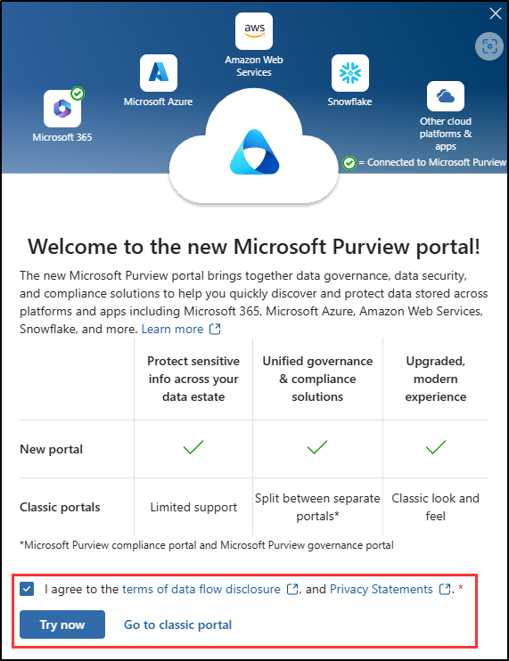

---
lab:
  task: Prepare your environment for administration
  exercise: Exercise 0 - Prepare your environment for administration
---

## Locatários do WWL – Termos de uso

Se você estiver recebendo um locatário como parte de uma entrega de treinamento com instrutor, observe que o locatário é disponibilizado com a finalidade de dar suporte aos laboratórios práticos no treinamento com instrutor.

Os locatários não devem ser compartilhados ou usados para fins fora dos laboratórios práticos. O locatário usado neste curso é um locatário de avaliação e não pode ser usado ou acessado após o fim da aula e não está qualificado para extensão.

Os locatários não podem ser convertidos em uma assinatura paga. Os locatários obtidos como parte deste curso permanecem a propriedade da Microsoft Corporation e reservamos o direito de obter acesso e a qualquer momento.

# Configuração do laboratório: Preparar seu ambiente para administração

Neste laboratório, você configurará e preparará seu ambiente para tarefas de administração. Você ativará os recursos necessários, configurará permissões administrativas e garantirá a configuração adequada dos principais elementos.

**Tarefas:**

- Habilitar a Auditoria no portal do Microsoft Purview
- Atribuir funções de conformidade
- Explorar o portal do Microsoft Purview

## Tarefa – Habilitar a Auditoria no portal do Microsoft Purview

Nesta tarefa, você habilitará a Auditoria no portal do Microsoft Purview para monitorar as atividades do portal. Para os exercícios nesses laboratórios, a Auditoria é necessária para criar uma política de rotulagem automática.

1. No Microsoft Edge, navegue até o portal do Microsoft Purview, `https://purview.microsoft.com`, e faça logon como um usuário com direitos de **Administrador Global**.

1. Uma mensagem sobre o novo portal do Microsoft Purview aparecerá na tela. Escolha a opção para concordar com os termos de divulgação de fluxo de dados e a política de privacidade e clique em **Experimentar agora**.

    

1. Selecione **Soluções** na barra lateral esquerda e escolha **Auditoria**.

1. Na página **Pesquisar**, selecione a barra **Iniciar gravação de atividades de usuário e administrador** para habilitar o registro em log de auditoria.

    

1. Depois de selecionar esta opção, a barra azul desaparecerá desta página.

>[!alerta] Se você receber um erro ao ativar a auditoria neste exercício, use estas etapas como solução alternativa:
>1. Abra uma janela elevada do Terminal clicando no botão Windows com o botão direito do mouse e selecione Terminal (Admin).
>1. Instale o módulo ExchangeOnlineManagement executando `Install-Module -Name ExchangeOnlineManagement`
>1. Conecte-se ao ExchangeOnlineManagement executando `Connect-ExchangeOnline`
>1. Quando solicitado, faça login inserindo o nome de usuário e a senha do administrador do seu provedor de hospedagem de laboratório.
>1. Para verificar se a Auditoria está habilitada, execute `Get-AdminAuditLogConfig | FL UnifiedAuditLogIngestionEnabled`
>1. Se for falso, o log de auditoria será desativado.
>1. Para habilitá-la, execute `Set-AdminAuditLogConfig -UnifiedAuditLogIngestionEnabled $true`
>   1. Se você receber um erro informando que não é possível executar o script em sua organização, execute `Enable-OrganizationCustomization`
>   1. Tente executar novamente `Set-AdminAuditLogConfig -UnifiedAuditLogIngestionEnabled $true`
>1. Para confirmar se a Auditoria está habilitada, execute `Get-AdminAuditLogConfig | FL UnifiedAuditLogIngestionEnabled`
>1. Depois de concluído, execute `Disconnect-ExchangeOnline` para encerrar a sessão

Você habilitou a auditoria no Microsoft 365.

## Tarefa – Atribuir funções de conformidade

Nesta tarefa, você atribuirá a função de **Administrador de conformidade** ao usuário que usará para esses exercícios de laboratório.

1. Abra o **Microsoft Edge** e navegue até o centro de administração do Microsoft 365, `https://admin.microsoft.com`. Você precisará fazer login como um usuário que tenha direitos de **Administrador Global**.

1. Expanda **Usuários** na barra lateral esquerda e clique em **Usuários ativos**.

1. Escolha ou crie um usuário para continuar com esses exercícios de laboratório.

   Se você optar por usar um usuário existente, escolha um usuário com direitos mínimos para privilégios de acesso mínimos.

   1. Se estiver criando um novo usuário, atribua ao usuário uma licença apropriada para esses exercícios de laboratório. O usuário deve ter uma licença do Microsoft 365 E5 ou um complemento compatível para esses exercícios. Atribua ao usuário a função de **Administrador de conformidade** nas configurações opcionais na configuração do novo usuário e finalize a criação do novo usuário.

   1. Se estiver modificando o acesso de um usuário existente, selecione o usuário e, em seguida, **Gerenciar funções**. Atribua ao usuário a função de **Administrador de Conformidade** e salve as alterações.

1. Saia da conta com o acesso de Administrador Global clicando no ícone de usuário no canto superior direito e, em seguida, em **Sair**.

   Exemplo:

   

Você atribuiu a um usuário a função de **Administrador de conformidade**, que é necessária para executar os diferentes exercícios deste laboratório.

## Tarefa – Explorar o portal do Microsoft Purview

Nesta tarefa, você entrará como o usuário ao qual concedeu anteriormente à função de **Administrador de conformidade** para explorar o portal do Microsoft Purview. Essa função será chamada de **Administrador de conformidade** nos próximos laboratórios e exercícios.

1. No **Microsoft Edge**, navegue até **`https://purview.microsoft.com`**.

1. Quando a janela **Escolher uma conta** for exibida, escolha **Usar outra conta**.

1. Quando a janela **Entrar** for exibida, entre como o usuário que você selecionou anteriormente como **Administrador de conformidade**.

1. Familiarize-se com o portal do Microsoft Purview. Quando terminar, deixe a janela do navegador aberta.

Você alternou para a conta do **Administrador de conformidade** e agora já pode iniciar o laboratório.
